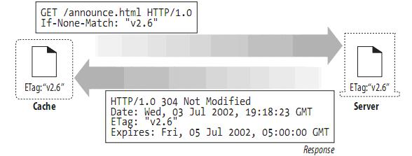

## 关于Android graphics的Camera和Matrix

### Camera

这是camera类的主要方法：
	
	public native void save();
	public native void restore();
	public native void translate(float x, float y, float z);
	public native void rotateX(float deg);
	public native void rotateY(float deg);
	public native void rotateZ(float deg);
	public native void rotate(float x, float y, float z);
	public native float getLocationX();
	public native float getLocationY();
	public native float getLocationZ();
	public native void setLocation(float x, float y, float z);
	public void getMatrix(Matrix matrix) {
	    nativeGetMatrix(matrix.native_instance);
	}
	public void applyToCanvas(Canvas canvas) {
	    nativeApplyToCanvas(canvas.mNativeCanvas);
	}
	public native float dotWithNormal(float dx, float dy, float dz);

这里是Camera变换的坐标轴

在rotate的时候，要站在该轴正方向的地方看，才能明白他的旋转。
如 camera.rotateZ(-60)

### Matrix

Matrix是一个3 x 3的2D空间矩阵

MPERSP_2指的是投影变换,其实际作用就是如果MPERSP_2=0.5，那么物体是原来的4倍大小；如果MPERSP_2=2，那么物体是原来的1/4大小。

Camera和Matrix的联合使用：一般情况下，如果我们需要进行3D变换，那么需要将Camera和Matrix联合使用，使用Camera进行x轴或y轴的旋转，使用Matrix进行平移或放大。